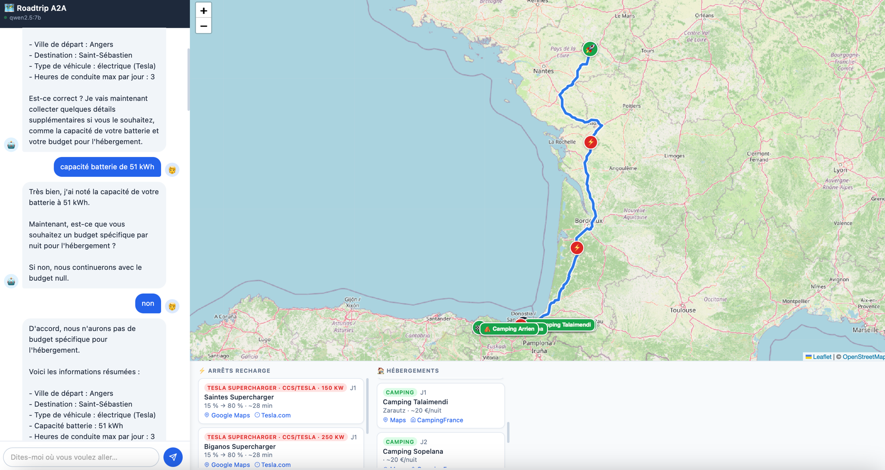
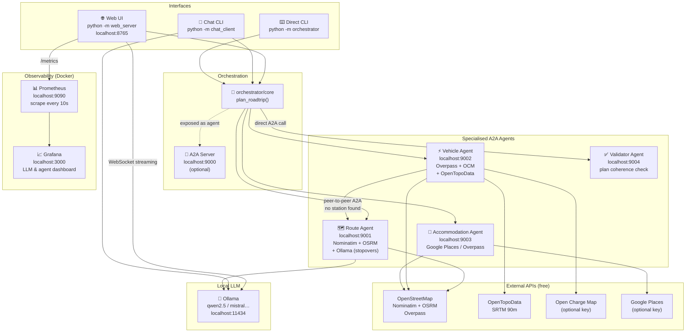
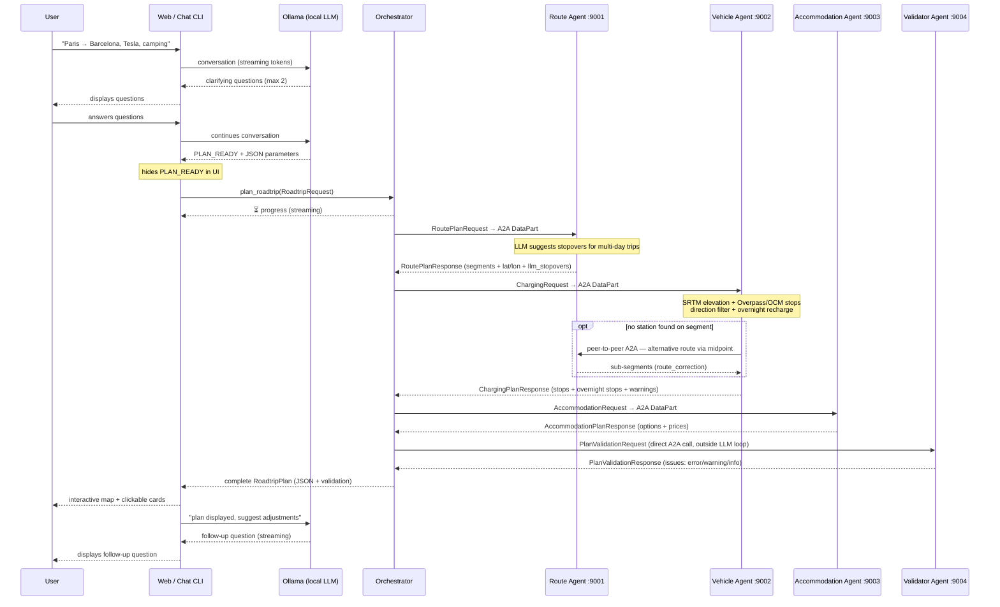
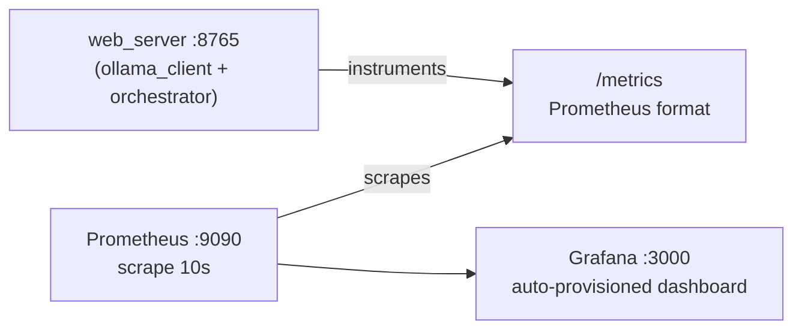

# Roadtrip A2A

> **Work in progress** — active development ongoing (AI route optimisation model, GPX export, multi-vehicle comparison…).


Road-trip planning assistant built on a **multi-agent A2A architecture**
([Agent2Agent protocol](https://a2a-protocol.org)): each concern
(routing, vehicle range, accommodation) is delegated to a dedicated, independently
deployed A2A agent.

Two interfaces are available: a **conversational chat** driven by a local LLM (Ollama)
in the terminal, and a **web UI** with an interactive map.

---



*Conversational chat (left) · Leaflet/OSM map with charging stops and accommodation (right) · Clickable cards with direct links*

---

## Features

- **Routing**: Nominatim/OSM geocoding, OSRM route calculation, day-by-day split; full road geometry stored per segment for accurate rendering
- **LLM-driven stopover planning**: `route_agent` uses Ollama to suggest meaningful intermediate cities for multi-day trips — instead of cutting at an arbitrary kilometre mark, the agent reasons about natural stopovers (e.g. Bordeaux between Paris and San Sebastián)
- **EV charging**: battery discharge simulation, real charging stops via Overpass/OSM or Open Charge Map (optional key), Tesla Supercharger filter
- **Overnight charging**: `vehicle_agent` automatically plans a recharge stop at each intermediate overnight waypoint (hotel, Tesla Camp Mode, campervan) — charges to 90 % by default so the next day starts with full range
- **Direction-aware stop search**: candidate charging stations are scored by direction and distance; stations requiring more than 40 km of backtracking are deprioritised — prevents suggesting a station in the wrong direction (e.g. Rennes when heading south)
- **A2A peer-to-peer**: when no charging station is found on a segment, `vehicle_agent` calls `route_agent` directly (without going through the orchestrator) to request an alternative route through the geographic midpoint
- **Plan validation**: `validator_agent` (port 9004) checks plan coherence after assembly — driving time per day, charging feasibility, accommodation coverage — and returns typed issues with `error` / `warning` / `info` severity
- **Elevation**: consumption correction using a physics-based EV model (mass, motor efficiency, regenerative braking), SRTM 90 m data via OpenTopoData (free, no key)
- **Accommodation**: hotels and campsites via Google Places (optional key) or Overpass/OSM, with price range estimates
- **Streaming**: real-time progress via A2A `TaskStatusUpdateEvent` during long computations
- **In-memory cache**: OSRM routes, Overpass stops, OCM stops and elevation cached to avoid redundant API calls
- **Orchestrator robustness**: code-level deduplication guard prevents the LLM from calling the same agent twice regardless of model behaviour
- **LLM chat**: Ollama-powered conversational interface (local model) that collects trip parameters and triggers planning
- **Web UI**: interactive Leaflet/OSM map — Google Maps-style double polyline following real road geometry, charging stops positioned along the actual route, clickable cards with direct links

## Architecture



## Data Flow



## APIs Used

| API | Usage | Key required |
|---|---|---|
| Nominatim / OSM | Geocoding | No |
| OSRM (public demo) | Route calculation | No |
| Overpass / OSM | Charging stops + accommodation | No |
| OpenTopoData SRTM 90m | Elevation for consumption correction | No |
| Ollama | Local LLM for conversational chat | No (local) |
| Open Charge Map | Enriched stop details (operator, connectors, kW) | Optional — free key at [openchargemap.org](https://openchargemap.org/site/develop) |
| Google Places | Accommodation with ratings and price levels | Optional — $200/month free credit at [console.cloud.google.com](https://console.cloud.google.com) |

## Installation

```bash
# Create and activate environment (conda or venv)
conda create -n roadtrip-a2a python=3.11
conda activate roadtrip-a2a

# Or with venv:
python3 -m venv .venv && source .venv/bin/activate

pip install -r requirements.txt

# For LLM chat and web UI — install Ollama
# https://ollama.com/download
ollama pull qwen2.5          # recommended lightweight model (~4.7 GB)
# or: ollama pull qwen2.5:7b

# Configure environment variables
cp .env.example .env
# Edit .env to add optional API keys
```

## Configuration (`.env`)

```dotenv
# Agent listening ports (defaults shown)
ROUTE_AGENT_PORT=9001
VEHICLE_AGENT_PORT=9002
ACCOMMODATION_AGENT_PORT=9003
VALIDATOR_AGENT_PORT=9004

# Agent URLs as seen by the orchestrator
ROUTE_AGENT_URL=http://localhost:9001
VEHICLE_AGENT_URL=http://localhost:9002
ACCOMMODATION_AGENT_URL=http://localhost:9003
VALIDATOR_AGENT_URL=http://localhost:9004

# LLM model used by the orchestrator and route_agent (must be available in Ollama)
OLLAMA_MODEL=qwen2.5
# Override the model used specifically by route_agent for stopover suggestions
# ROUTE_AGENT_LLM_MODEL=qwen2.5:1.5b   # lighter model for faster responses

# Optional API keys
OPEN_CHARGE_MAP_KEY=   # enriched stop details (operator, connectors, power)
GOOGLE_PLACES_KEY=     # accommodation with real ratings and price levels
```

## Running

### Web UI + monitoring (recommended)

Start the services in separate terminals (or with `&`):

```bash
# Terminal 1 — local LLM
ollama serve

# Terminal 2 — planning agents
python -m route_agent &          # :9001  routing + LLM stopovers
python -m vehicle_agent &        # :9002  charging stops + elevation
python -m accommodation_agent &  # :9003  hotels + campsites
python -m validator_agent &      # :9004  plan coherence check

# Terminal 3 — web server (also exposes /metrics)
python -m web_server             # :8765

# Terminal 4 — monitoring stack (requires Docker)
docker compose -f docker-compose.monitoring.yml up -d
```

| URL | Description |
|---|---|
| http://localhost:8765 | Web UI (chat + map) |
| http://localhost:8765/metrics | Raw Prometheus metrics |
| http://localhost:9090 | Prometheus UI |
| http://localhost:3000 | Grafana dashboard (admin / roadtrip) |

The **Roadtrip A2A — LLM & Agent Performance** dashboard opens automatically in Grafana.

### Stop monitoring

```bash
docker compose -f docker-compose.monitoring.yml down
# To also remove historical data:
docker compose -f docker-compose.monitoring.yml down -v
```

### Terminal chat

```bash
# (agents + ollama serve already running)
python -m chat_client

# Force a specific model
python -m chat_client --model qwen2.5:7b
# Or via environment variable
OLLAMA_MODEL=mistral python -m chat_client
```

### Direct CLI (no LLM)

```bash
# (agents already running)
python -m orchestrator \
    --origin Paris --destination Barcelona --waypoint Lyon \
    --vehicle electric --battery-kwh 60 --consumption 17 \
    --max-hours-per-day 5

# Raw JSON output
python -m orchestrator \
    --origin Paris --destination Nice --vehicle thermal --format json

# Tesla Supercharger only, camping
python -m orchestrator \
    --origin Paris --destination Barcelona --waypoint Bordeaux \
    --vehicle electric --battery-kwh 75 --consumption 16 \
    --tesla-supercharger --accommodation camping
```

### Stop agents

```bash
pkill -f "python -m route_agent"
pkill -f "python -m vehicle_agent"
pkill -f "python -m accommodation_agent"
pkill -f "python -m validator_agent"
```

### A2A server (optional)

```bash
python -m orchestrator.server   # exposes the orchestrator on :9000
```

## CLI options (`python -m orchestrator`)

| Option | Description | Default |
|---|---|---|
| `--origin` | Departure city | required |
| `--destination` | Arrival city | required |
| `--waypoint` | Intermediate stop (repeatable) | — |
| `--vehicle` | `electric` or `thermal` | `thermal` |
| `--battery-kwh` | Battery capacity in kWh | 60 (if electric) |
| `--consumption` | Consumption in kWh/100km | 17 (if electric) |
| `--max-hours-per-day` | Max driving hours per day | `6.0` |
| `--accommodation` | `hotel`, `camping`, `no_preference` | `no_preference` |
| `--budget` | Accommodation budget €/night | — |
| `--tesla-supercharger` | Search Tesla Superchargers only | `false` |
| `--start-date` | Departure date ISO (e.g. `2026-08-10`) | — |
| `--format` | `text` (readable) or `json` (raw) | `text` |

## Project Structure

```
roadtrip-a2a/
├── common/
│   ├── schemas.py          # Pydantic models shared between agents
│   ├── elevation.py        # Elevation correction via OpenTopoData (SRTM 90m)
│   ├── geocoding.py        # Nominatim geocoding (cache + "lat,lon" bypass)
│   ├── a2a_client_utils.py # Generic A2A HTTP client
│   └── a2a_data_utils.py   # DataPart + TaskStatusUpdateEvent helpers
├── route_agent/            # agent :9001 — OSRM routing + LLM stopover suggestions
├── vehicle_agent/          # agent :9002 — charging stops + elevation + overnight recharge
├── accommodation_agent/    # agent :9003 — accommodation
├── validator_agent/        # agent :9004 — plan coherence validation (new)
├── orchestrator/
│   ├── core.py             # direct orchestration (no server)
│   ├── __main__.py         # Python CLI
│   └── server.py           # exposed as A2A agent on :9000
├── chat_client/
│   ├── ollama_client.py    # Ollama client (streaming via /api/chat)
│   └── __main__.py         # conversational terminal chat
├── web_server/
│   ├── __main__.py         # FastAPI + WebSocket :8765 + /metrics
│   └── static/index.html   # SPA (Leaflet, chat, accommodation/charging cards)
├── monitoring/
│   ├── metrics.py          # Prometheus metric definitions (14 metrics)
│   ├── prometheus.yml      # Prometheus scrape config
│   └── grafana/
│       ├── provisioning/   # auto-provisioned datasource + dashboard
│       └── dashboards/roadtrip_a2a.json  # pre-wired dashboard
├── tests/                  # 127 tests (pytest, respx, asyncio)
├── docker-compose.monitoring.yml  # Prometheus :9090 + Grafana :3000
└── docs/
    └── screenshot.png      # web UI screenshot
```

## Technical Details

### Elevation and EV consumption

`common/elevation.py` queries OpenTopoData (SRTM 90 m) for 8 sampled points
between the start and end of each segment, then computes a correction factor:

```
baseline_kwh = consumption_kwh_100km / 100 × distance_km
extra_climb  = gain_m × 1800 kg × g / (motor_efficiency × 3_600_000)
saved_regen  = loss_m × 1800 kg × g × regen_efficiency / 3_600_000
factor       = (baseline + extra_climb − saved_regen) / baseline  [clamped 0.5–2.5]
```

A warning is added to the plan if the factor deviates more than 5 % from 1.

### In-memory cache

| Module | Cache | Key |
|---|---|---|
| `route_agent/core.py` | OSRM routes | `"lat,lon\|lat,lon"` |
| `vehicle_agent/core.py` | Overpass stops | `(lat×3, lon×3, tesla_only)` |
| `vehicle_agent/core.py` | OCM stops | `(lat×3, lon×3, tesla_only)` |
| `common/elevation.py` | Elevation points | `"lat,lon\|…\|n"` |
| `common/geocoding.py` | Nominatim coordinates | place name |

### Overpass rate limiting

Overpass requests are limited to 2 concurrent requests via `asyncio.Semaphore(2)`
to avoid 429 errors on multi-stop trips. Timeouts: 25 s per request, 30 s httpx connection.

### Web UI

The FastAPI server (`web_server/__main__.py`) exposes a `/ws/chat` WebSocket that:
1. Streams Ollama tokens to the frontend
2. Detects the `PLAN_READY:` marker in the LLM response (with fallback to any valid JSON block)
3. Hides the marker and JSON from the chat bubble
4. Calls `plan_roadtrip()` directly and sends the structured plan
5. Displays stops and accommodation on the Leaflet map

**Map rendering** — each route segment is drawn as a double polyline (white 9 px shadow + blue 5 px main line with round caps/joins) following the actual road geometry returned by OSRM and stored in `RouteSegment.path_hint`. Charging stop markers are positioned by walking the real polyline at the exact `distance_from_day_start_km` fraction via `pointAlongPolyline()`, so they land on the road rather than on the straight line between segment endpoints.

Clickable cards include Google Maps links for each stop/accommodation,
Tesla.com links for Superchargers, and CampingFrance/Booking.com links for accommodation.

### Observability (Prometheus + Grafana)

`monitoring/metrics.py` defines 14 metrics instrumented via `prometheus_client` and
exposed at `GET /metrics` on the web server. Prometheus scrapes this endpoint every 10 s;
Grafana visualises in real time.



**Available metrics:**

| Category | Metric | Type | Labels |
|---|---|---|---|
| LLM | `roadtrip_llm_request_duration_seconds` | Histogram | `model`, `status` |
| LLM | `roadtrip_llm_time_to_first_token_seconds` | Histogram | `model` |
| LLM | `roadtrip_llm_tokens_generated_total` | Counter | `model` |
| LLM | `roadtrip_llm_tokens_per_second` | Histogram | `model` |
| LLM | `roadtrip_llm_requests_total` | Counter | `model`, `status` |
| LLM | `roadtrip_llm_conversation_turns_total` | Counter | `model` |
| Planning | `roadtrip_planning_duration_seconds` | Histogram | `status` |
| Planning | `roadtrip_planning_requests_total` | Counter | `status` |
| Planning | `roadtrip_plan_extractions_total` | Counter | `status` |
| A2A Agents | `roadtrip_agent_call_duration_seconds` | Histogram | `agent`, `status` |
| A2A Agents | `roadtrip_agent_calls_total` | Counter | `agent`, `status` |
| WebSocket | `roadtrip_websocket_connections_active` | Gauge | — |
| WebSocket | `roadtrip_websocket_messages_total` | Counter | `direction` |
| Cache | `roadtrip_cache_operations_total` | Counter | `cache`, `result` |

**Grafana dashboard** (`monitoring/grafana/dashboards/roadtrip_a2a.json`) — 4 rows:
- **Overview**: LLM requests/min, active connections, plans generated, success rate
- **LLM Performance**: duration p50/p95/p99, TTFT p50/p95, tokens/s rate
- **Planning & Agents**: duration by agent (route / vehicle / accommodation), call rates
- **WebSocket & Errors**: connections, message throughput, LLM and agent error rates

### Message schemas (`common/schemas.py`)

| Request | Response | Agent |
|---|---|---|
| `RoutePlanRequest` | `RoutePlanResponse` (+ `RouteSegment` with lat/lon, `llm_stopovers`, `warnings`) | Route Agent |
| `ChargingRequest` | `ChargingPlanResponse` (+ elevation warnings, `route_correction`) | Vehicle Agent |
| `AccommodationRequest` | `AccommodationPlanResponse` | Accommodation Agent |
| `PlanValidationRequest` | `PlanValidationResponse` (list of `ValidationIssue`) | Validator Agent |
| `RoadtripRequest` | `RoadtripPlan` (+ `validation`) | Orchestrator |

**Notable fields:**

- `RoutePlanResponse.llm_stopovers` — cities suggested by the route_agent LLM (e.g. `["Bordeaux"]` for Paris→San Sebastián)
- `ChargingRequest.overnight_charging` (default `true`) — whether to plan a recharge stop at each intermediate overnight waypoint
- `ChargingRequest.overnight_charge_to_percent` (default `90.0`) — target charge level for overnight stops
- `ChargingStop.is_overnight` — distinguishes overnight recharge stops from en-route stops
- `ChargingPlanResponse.route_correction` — alternative sub-segments proposed by `route_agent` via peer-to-peer A2A when no station is found
- `ValidationIssue.severity` — `"error"` (plan infeasible), `"warning"` (non-blocking concern), `"info"` (informational)

`RouteSegment` embeds geocoded coordinates (`start_lat/lon`, `end_lat/lon`) and the
full road geometry as a JSON-encoded `[[lat, lon], …]` list in `path_hint` (populated
from OSRM step-level GeoJSON). Downstream agents avoid re-geocoding; the frontend uses
`path_hint` to draw real road polylines and position charging stop markers precisely.

## Tests

```bash
pip install -r requirements-dev.txt
pytest tests/ -v
```

127 tests across 9 modules:

| Module | Tests | Coverage |
|---|---|---|
| `test_schemas.py` | 14 | Pydantic model validation |
| `test_route_core.py` | 16 | Haversine distance, `_parse_city_list` (LLM JSON robustness) |
| `test_geocoding.py` | 12 | Nominatim HTTP-mocked, `"lat,lon"` bypass |
| `test_elevation.py` | 15 | EV physics model (consumption factor) |
| `test_validator_agent.py` | 28 | Plan validation: driving time, charging, accommodation |
| `test_vehicle_agent.py` | 31 | Direction filter (`_is_forward`), best-station selection, overnight charging |
| `test_metrics.py` | 11 | Prometheus metric definitions |
| `test_a2a_data_utils.py` | — | A2A message helpers (requires `a2a` SDK) |
| `test_llm_core_dedup.py` | — | Orchestrator deduplication guard (requires `a2a` SDK) |

## Roadmap

Planned features (not yet implemented):

- **LLM per agent** (vehicle, accommodation): give each agent its own reasoning capability so they can make autonomous decisions rather than executing deterministic logic
- **GPX export**: download the complete itinerary for GPS/phone
- **Multi-vehicle comparison**: compare several vehicles side by side (range, cost)
- **Weather integration**: incorporate weather forecasts along the route to adjust EV consumption (cold, wind)
- **Real-time electricity prices**: OCM and Chargemap sometimes provide per-network tariffs
- **Plan persistence**: save and share a plan via URL
- **Mobile app**: PWA or React Native wrapper around the web UI
